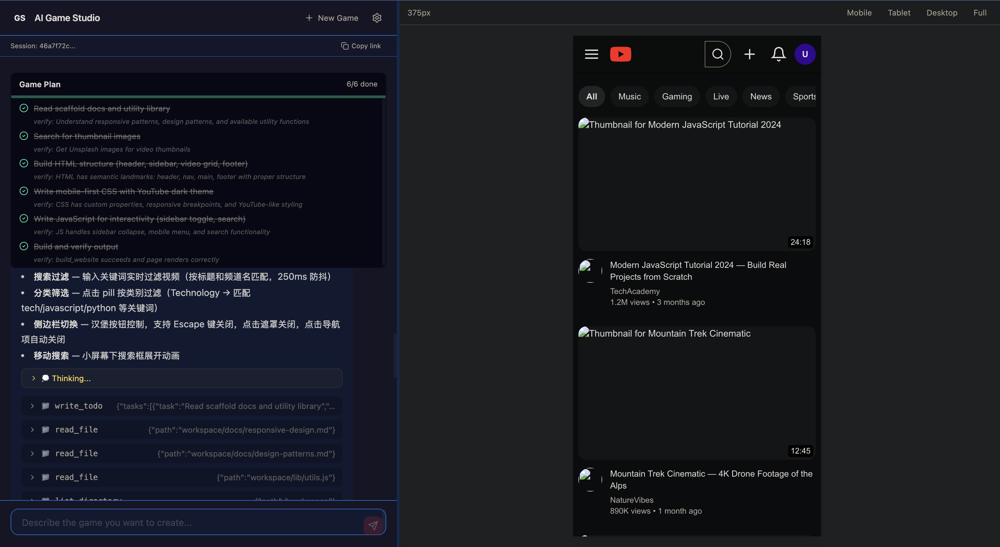

<p align="center">
  
  
  
  
  
  <br>
  
  
  
  
  
</p>

# AI Web Studio

**Chat with an AI agent to generate production-ready websites — HTML, CSS, and JavaScript — instantly previewable in a split-panel UI.**

*用自然语言创造网站 — 对话即开发，所见即所得。*

<br>

<p align="center">
  
</p>

<br>

---

## What Makes This Different

Most AI coding tools generate code in a text editor. AI Web Studio runs a **scaffold-first agent pipeline** — the AI reads authoritative web development guides, studies production-quality templates, and writes body-only HTML that a build pipeline wraps into a complete, self-contained site. You see the result instantly in a sandboxed preview.

| Traditional AI Coding | AI Web Studio |
|---|---|
| Generates code snippets in an IDE | Generates complete, standalone Sites |
| You figure out how to preview it | Instant iframe preview with viewport controls |
| No guardrails — AI guesses best practices | 6 scaffold guides + 21 gotchas enforce quality |
| Manual iteration — copy, paste, tweak | Multi-turn conversation refines in place |

---

## Screenshot

> Split-panel design: chat with the agent on the left, preview the generated site on the right. Viewport presets (375/768/1200px), draggable resize handle, fullscreen mode. Todo cards track progress.

---

## Quick Start

```bash
git clone https://github.com/1998x-stack/ai-web.git
cd ai-web
npm install
npm run dev
```

Open `http://localhost:3000`, configure your DeepSeek API key in Settings, and describe the site you want.

**Requirements**: Node.js 18+ · [DeepSeek API Key](https://platform.deepseek.com/)

---

## How It Works

```
┌──────────────────────────────────────────────────────────────────┐
│                        AI Web Studio                              │
├──────────────────────┬───────────────────────────────────────────┤
│   Chat Panel (left)  │        Site Preview (right)               │
│                      │                                            │
│  ┌────────────────┐  │  ┌─────────────────────────────────────┐  │
│  │ "Build a SaaS  │  │  │                                     │  │
│  │  landing page" │──┼─▶│   ┌───────────────────────────┐    │  │
│  └────────────────┘  │  │   │  Generated Site            │    │  │
│                      │  │   │  (sandbox iframe)          │    │  │
│  ┌────────────────┐  │  │   └───────────────────────────┘    │  │
│  │ Agent reads    │◀─┼──│                                     │  │
│  │ scaffold →     │  │  │   [Mobile | Tablet | Desktop]      │  │
│  │ plans → writes │  │  │   [Fullscreen] [Resize Handle]     │  │
│  │ → builds → ✅  │  │  └─────────────────────────────────────┘  │
│  └────────────────┘  │                                            │
├──────────────────────┴───────────────────────────────────────────┤
│                   Agent Pipeline (11 tools)                        │
│   System Prompt → 6 Scaffold Docs → Gotchas → Templates → Loop    │
│         ↓                     ↓                                    │
│   scripts/*.{html,css,js}  build_website → output/index.html       │
│         ↓                     ↓                                    │
│   /api/preview/{id} → iframe    Unsplash → real images              │
└────────────────────────────────────────────────────────────────────┘
```

### The Agent Loop

1. **User sends a prompt** — "Build a modern portfolio with dark theme"
2. **Agent reads scaffold** — 6 web dev guides (responsive design, patterns, a11y, SEO, interactive UI, gotchas)
3. **Agent plans** — writes a todo checklist with verifiable tasks
4. **Agent writes code** — body-only HTML in `scripts/index.html`, CSS in `styles.css`, JS in `main.js`
5. **Agent finds assets** — searches Unsplash for real stock photos, falls back to placeholders
6. **Build pipeline assembles** — wraps body content in complete document shell with meta tags, skip-link, error handler, inlined CSS/JS, base64 assets
7. **Preview updates instantly** — sandbox iframe renders the built Site

---

## Core Features

<table>
<tr>
<td width="50%">

### Scaffold-First Generation
The agent reads 6 authoritative web development guides before writing a single line of code. 21 documented gotchas prevent common mistakes. Every generated site follows semantic HTML, responsive CSS, and accessible patterns by default.

### Streaming Transparency
Every tool call, reasoning chain, and code output streams in real-time. You see the agent read docs, plan tasks, write files, search for images — not a black box.

### Subagent Delegation
The agent spawns up to 3 research subagents for reading documentation and searching patterns, freeing the main agent for high-level design decisions.

</td>
<td width="50%">

### Iterative Refinement
Multi-turn conversations refine every aspect — layout, colors, typography, interactivity — without starting over. The agent reads existing files and makes targeted edits.

### Model Resilience
Automatic failover to fallback model on API errors. If the primary model is unavailable, the system retries with the backup — for both the main loop and subagents.

### Session Persistence
JSONL-based conversation storage survives server restarts. Restore any session with `?session={uuid}`. Workspace files (scripts, assets, output) persist on disk.

</td>
</tr>
</table>

### All Features

| Feature | Description |
|---|---|
| **11 Agent Tools** | File ops (read/write/edit/list/grep), build, Unsplash search, plan, delegate, error reporting |
| **4 Site Templates** | Landing page, portfolio, blog, dashboard — production-quality reference implementations |
| **Self-Contained Output** | All HTML, CSS, JS, and assets inlined into one file. Zero external dependencies |
| **Viewport Controls** | 375px mobile, 768px tablet, 1200px desktop presets + draggable resize handle + fullscreen |
| **Todo Visualization** | Agent's plan rendered as interactive progress cards with checkboxes and completion stats |
| **Unsplash Integration** | Agent searches real stock photos. Three-tier fallback: Unsplash → picsum → inline SVG placeholder |
| **Knowledge Flywheel** | Gotchas, utils, and skills are agent-extensible. Every solved problem becomes reusable knowledge |
| **BYO-Key Architecture** | API key stored in browser localStorage only. Never touches the server |
| **Defense in Depth** | 4-layer path validation: `..` rejection → workspace boundary → path separator check → symlink resolution |
| **Accessibility Baseline** | Semantic HTML, ARIA, keyboard nav, color contrast, skip-to-content link — auto-enforced by packager |

---

## Tech Stack

| Layer | Technology |
|---|---|
| Framework | Next.js 14 (App Router) |
| Language | TypeScript 5.4 |
| Styling | Tailwind CSS 3.4 |
| Agent SDK | DeepSeek API (OpenAI-compatible) |
| Output Format | Single HTML file (inlined CSS + JS + base64 assets) |
| Sandbox | iframe `allow-scripts` |
| Persistence | JSONL files + in-memory Map |
| Testing | Vitest |

---

## Project Structure

```
ai-web/
├── app/                          # Next.js pages + API routes
│   └── api/
│       ├── chat/route.ts         # Agent chat (POST, SSE streaming)
│       ├── build/route.ts        # Manual build trigger
│       ├── preview/[id]/route.ts # Site preview serving
│       └── session/[id]/route.ts # Session restore
├── components/                   # React components
│   ├── ChatPanel.tsx             # Chat + Markdown + TodoCard
│   ├── WebsitePreview.tsx        # Sandbox iframe + viewport controls
│   ├── SettingsModal.tsx         # API key configuration
│   └── ErrorConsole.tsx          # Runtime error display
├── lib/
│   ├── agent/                    # Agent SDK (factory + DeepSeek adapter)
│   ├── build/packager.ts         # Scripts + assets → single Site
│   ├── workspace/manager.ts      # Session isolation + scaffold copy
│   └── session-store.ts          # JSONL persistence
├── workspace/                    # Scaffold knowledge base
│   ├── docs/                     # 6 web development guides
│   ├── templates/                # 4 website templates
│   ├── lib/utils.js              # 12 reusable web utilities
│   └── agent.md                  # Agent system instructions
├── user_space/                   # Runtime sessions (gitignored)
├── assets/                       # GitHub Pages landing page
└── docs/                         # Specs, ADRs, implementation plans
```

---

## Design Philosophy

| Principle | Practice |
|---|---|
| Scaffold-First | Agent reads docs + gotchas + templates before generating code |
| Packager Owns Document Shell | Agent writes body content. Packager wraps with DOCTYPE, meta, skip-link, error handler |
| Single File Output | All HTML/CSS/JS inlined. No frameworks, no CDN dependencies |
| BYO-Key | No server-side key storage. API key lives in browser localStorage |
| Model Resilience | Automatic failover to fallback model on API errors |
| Mobile-First | Generated Sites use mobile-first CSS (breakpoints: 640, 768, 1024, 1280) |
| Accessibility by Default | Semantic HTML, ARIA, keyboard nav, contrast — enforced by scaffold, not optional |
| Knowledge Flywheel | Agent-extensible gotchas, utils, and skills — every session improves the scaffold |

---

## Documentation

| Document | Purpose |
|---|---|
| [CONTEXT.md](./CONTEXT.md) | Domain glossary — Agent, Site, Workspace, Scaffold, Build Pipeline |
| [AGENTS.md](./AGENTS.md) | Quick reference for agents working on this project |
| [DEVELOPMENT.md](./DEVELOPMENT.md) | Developer gotchas and conventions |
| [Design Spec](./docs/superpowers/specs/2026-05-26-ai-web-design.md) | Full technical specification |
| [ADR-0001](./docs/adr/0001-single-page-sites-v1.md) | Decision: single-page Sites for v1 |
| [ADR-0002](./docs/adr/0002-packager-owns-document-shell.md) | Decision: packager owns document shell |

---

## Contributing

1. Read [CONTEXT.md](./CONTEXT.md) — domain language and concepts
2. Read [DEVELOPMENT.md](./DEVELOPMENT.md) — gotchas and conventions
3. Extend the scaffold — add templates, gotchas, or skills under `workspace/`
4. Add a new LLM provider — implement `AgentSession` interface
5. Add a new tool — define + register in `lib/agent/tools.ts`

---

## License

MIT © 2024 AI Web Studio

---

<p align="center">
  <sub>Built with Next.js · DeepSeek · Tailwind CSS</sub>
</p>
